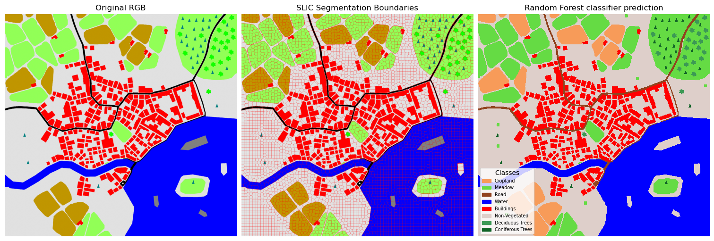

## Object based image classification using Randon Forest (RF) and Support Vector Machine (SVM)

Object-based image classification is a crucial technique in remote sensing that groups pixels into meaningful objects before classification, improving accuracy over pixel-based methods. This project extends an existing classification workflow by incorporating Random Forest (RF) and Support Vector Machine (SVM) classifiers for enhanced land cover classification.

Using SLIC segmentation, the Artificial_landscape_UTM_012025 image is divided into multiple classes, including cropland, meadow, roads, water bodies, buildings, and vegetation types. The workflow includes interactive sample collection, classification refinement, and post-processing techniques such as merging similar classes, identifying boats, classifying farmhouses, and differentiating water bodies into rivers and lakes. A legend is added to improve interpretability.

By integrating machine learning methods with object-based classification, this project enhances the precision of land cover mapping, providing a more structured approach to image analysis.

## Results

